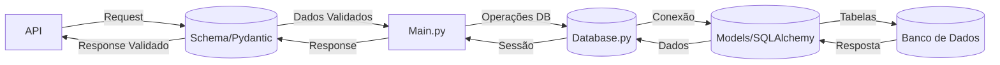

# api

conceitos utilizados

- FastAPI
- pytest
- CI/CD
- pydantic
- docker

 

- schema.py: Valida dados da API (regras de negócio) com Pydantic.
- database.py: Gerencia conexões (abre/fecha sessões) com o banco utilizando com SQLAlchemy.
- models.py: Define tabelas do banco 
- main.py: Orquestra tudo - recebe dados → valida → persiste → retorna respostas.

Exemplo de Fluxo (Passo a Passo)

API recebe um POST (ex: { "nome": "Teclado", "preco": 350 })
- schema.py valida (checa se nome é string, preco é número positivo).
- main.py pega os dados validados e:
    - Usa database.py para abrir uma sessão.
    - Converte o schema em model (ex: ProdutoDB(nome="Teclado", preco=350)).
- Persiste no banco via models.py.
- Banco salva e retorna o dado (ex: com id=1 gerado).

API recebe um GET
- main.py formata a resposta (opcionalmente converte model → schema).
- API devolve (ex: { "id": 1, "nome": "Teclado", "preco": 350 }).

Schema = "Porta de entrada" (valida o que entra/sai).
Models = "Molde do banco" (estrutura dos dados no DB).
Database = "Motorista" (leva os dados do Python para o banco).
Main = "Maestro" (coordena quem faz o quê).

