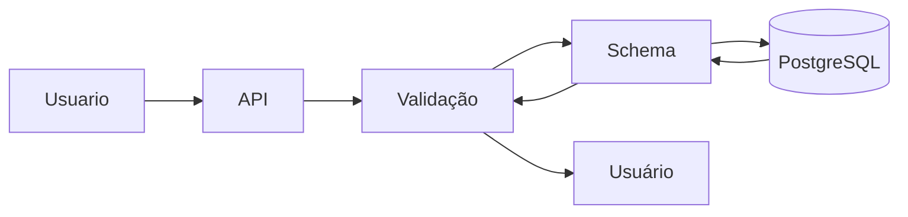

# API de Produtos com FastAPI e PostgreSQL

Projeto de API para gerenciamento de produtos com validação de dados, containerização Docker e pipeline CI/CD integrada.

<br>

## Tecnologias Utilizadas

| Componente       | Tecnologias                          |
|------------------|--------------------------------------|
| **Framework**    | FastAPI                              |
| **Banco**        | PostgreSQL (SQLAlchemy ORM)          |
| **Validação**    | Pydantic                             |
| **Automação**    | Taskipy                              |
| **Testes**       | pytest (com cobertura)               |
| **Container**    | Docker + Docker Compose              |
| **CI/CD**        | GitHub Actions                       |

<br>

## Arquitetura do Projeto



<br>

## Estrutura de Projeto
```plaintext
.
├── app/
│   ├── __init__.py
│   ├── main.py                 # Rotas e lógica principal
│   ├── database.py             # Conexão com o banco
│   ├── models.py               # Modelos SQLAlchemy
│   ├── schemas.py              # Modelos Pydantic
│   └── tests/                  # Testes automatizados
├── docker-compose.yml          # Orquestração de containers
├── Dockerfile                  # Build da aplicação
├── requirements.txt            # Dependências para o render
├── uv.lock                     # Dependências para UV
├── .env                        # Variáveis de ambiente (contém senhas genéricas)
└── .github/workflows/          # Pipeline CI/CD

# Configurações de infraestrutura
├── custom-pg_hba.conf          # Configuração de autenticação do PostgreSQL (permissivo - apenas para desenvolvimento)
├── custom-postgresql.conf      # Configurações customizadas do PostgreSQL
├── init-postgres.sh            # Script de inicialização do banco (cria schemas/roles)
└── init.sh                     # Script auxiliar para setup inicial

# Advertências de Segurança
- custom-pg_hba.conf: permite qualquer conexão sem autenticação
- .env: contém credenciais genéricas apenas para fins didáticos
```

<br>

## Fluxo de Dados

API recebe um POST (ex: { "nome": "Teclado", "preco": 350 })
- schema.py valida (checa se nome é string, preco é número positivo).
- main.py pega os dados validados e:
    - Usa database.py para abrir uma sessão.
    - Converte o schema em model (ex: ProdutoDB(nome="Teclado", preco=350)).
- Persiste no banco via models.py.
- Banco salva e retorna o dado (ex: com id=1 gerado).

<br>

De forma didática:
- Schema = "Porta de entrada" (valida o que entra/sai).
- Models = "Molde do banco" (estrutura dos dados no DB).
- Database = "Motorista" (leva os dados do Python para o banco).
- Main = "Maestro" (coordena quem faz o quê).

<br>

### CI/CD
O pipeline inclui:
 - Build dos containers
- Execução de testes
- Verificação de qualidade de código

<br>

## Instruções de Setup
0. Pré-Requisitos
    - Python versão > 3.12
    - Biblioteca uv (instale usando o comando `pipx install uv` ou `pip install uv`)
    - Docker

<br>

1. Clone o repositório e mude o diretório
```bash
git clone https://github.com/kajinmo/eda-black-friday
cd eda-black-friday
```

<br>

2. Crie um ambiente venv e instale as dependências com `uv`
```bash
uv sync
```

<br>

3. Ative o ambiente virtual
```bash
source .venv/Scripts/activate
```

<br>

4. Abra o VSCode
```bash
code .
```

<br>

5. Configurar o VSCode para usar o ambiente virtual

- Abrir o Command Palette (`Ctrl+Shift+P` or `Cmd+Shift+P` on macOS)
- Procure por "`Python: Select Interpreter`"
- Escolha o interpretador dentro da pasta `.venv` (e.g., .venv/bin/python or .venv\Scripts\python.exe)

<br>

6. Execução com Docker e Testes
```bash
# Iniciar containers
task run
Acesse a API: http://localhost:8000/docs

# Executar testes localmente
task test

# Parar serviços
task kill
```

